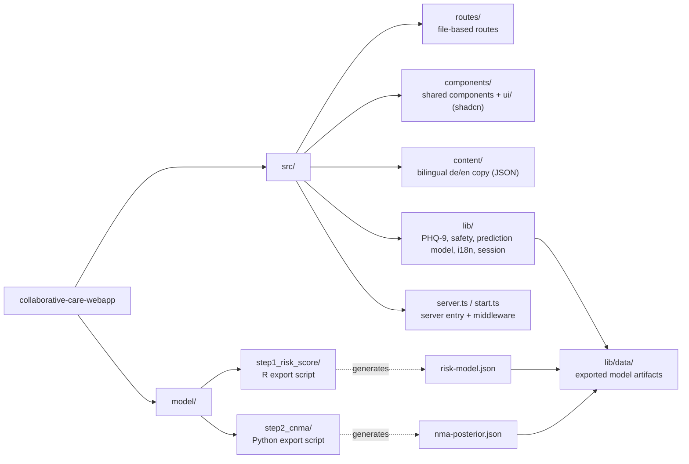

# Collaborative Care Compass — Web App

Web prototype of the Collaborative Care Compass. For the project background, data and modelling approach, see the **main project README** at [`DSSGxMunich/collaborative-care-analysis`](https://github.com/DSSGxMunich/collaborative-care-analysis).

**Live:** https://dssgxmunich.github.io/collaborative-care-webapp/

## Data privacy

Patient data is never sent to or stored on a server. All answers stay in the browser:

- Questionnaire answers are kept only in the tab's `sessionStorage` ([`src/lib/session.tsx`](src/lib/session.tsx)) and are deleted when the tab or browser is closed.
- Predictions and the PDF report are computed entirely client-side; the app is deployed as a static site with no backend.
- The only value persisted across sessions is the language preference (`localStorage`), which contains no patient data.

## Tech stack

- [TanStack Start](https://tanstack.com/start) (React 19, file-based routing via TanStack Router)
- [Tailwind CSS](https://tailwindcss.com/) v4 + [shadcn/ui](https://ui.shadcn.com/)
- [Vite](https://vite.dev/) + [Nitro](https://nitro.build/)
- TypeScript, ESLint, Prettier

## Setup

Requires [Bun](https://bun.sh/) 1.x (Node.js 20+ to run the built server output).

```sh
git clone https://github.com/DSSGxMunich/collaborative-care-webapp
cd collaborative-care-webapp
bun install
bun run dev        # http://localhost:3000
```

## Scripts

| Command                | Description                      |
| ---------------------- | -------------------------------- |
| `bun run dev`          | Start the dev server             |
| `bun run build`        | Production build into `.output/` |
| `bun run build:dev`    | Unminified development build     |
| `bun run preview`      | Preview the production build     |
| `bun run lint`         | ESLint                           |
| `bun run format`       | Prettier (write)                 |
| `bun run format:check` | Prettier (check only)            |
| `bun run typecheck`    | `tsc --noEmit`                   |

Run the production server with `node .output/server/index.mjs`.

## Deployment

Pushes to `main` build a fully prerendered static site and publish it to GitHub Pages via [`.github/workflows/deploy-pages.yml`](.github/workflows/deploy-pages.yml). The workflow sets `GITHUB_PAGES_BASE=/collaborative-care-webapp/`; local builds without it target the root path.

## Project structure



Routing conventions are documented in [`src/routes/README.md`](src/routes/README.md).

## Model integration

The app runs the prediction client-side from two JSON exports; the models themselves are fitted in the [analysis repo](https://github.com/DSSGxMunich/collaborative-care-analysis).

| File                              | Code                   | Source                                      |
| --------------------------------- | ---------------------- | ------------------------------------------- |
| `src/lib/data/risk-model.json`    | `src/lib/riskScore.ts` | Step 1 risk score (`ordinal::clmm`, R)      |
| `src/lib/data/nma-posterior.json` | `src/lib/model.ts`     | Step 2 CNMA posterior draws (PyMC, thinned) |
